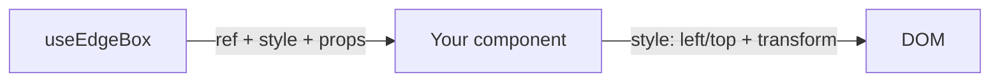

# EdgeBox Lite - `@edgebox-lite/react`

EdgeBox is a lightweight hook system for building **floating UI** in React (draggable menus, resizable panels, chat windows, tool palettes) using an **edges-first** coordinate model.

It’s designed for smooth interactions and low overhead:

- Uses `transform: translate3d(...)` for motion (good GPU-friendly rendering, avoids layout thrash)
- Keeps the runtime dependency-free and the math simple (good for low CPU usage during pointer move)
- Supports “commit” mode so frequent pointer updates don’t permanently rewrite your committed position

This repo contains the `@edgebox-lite/react` package.

## Features (at a glance)

- **Anchored positioning**: start at `top-left`, `bottom-right`, `top-center`, etc.
- **Edges-first model**: position is stored as `left/right/top/bottom` viewport coordinates.
- **Drag**: pointer drag with safe-zone clamping (keeps the element on-screen).
- **Resize**: 8-direction resize with min/max constraints and safe-zone clamping.
- **Multitouch-safe gestures**: drag and resize track the initiating mouse/touch `eventId`, so extra touches do not steal the active gesture.
- **Commit or not**: you can keep temporary offsets in state, or “commit” the final result back into `edges`.
- **Auto focus snapping** (optional): snap to edges / center / corners when a gesture ends.
- **Viewport clamp for auto-sized elements**: measure DOM size changes (via `ResizeObserver`) and clamp into the viewport.
- **SSR-aware**: hooks guard access to `window`.

## Compatibility

**Languages**

- JavaScript (ESM + CJS builds)
- TypeScript (types included)

**React**

- React `>=18` (hooks)

**Frameworks / bundlers**

- Vite
- Next.js (client components; SSR-safe guards included)
- Remix
- CRA / custom Webpack

In general, it works in any React app that can run hooks in the browser.

## Install

Published package:

```bash
npm install @edgebox-lite/react
```

Local development (this repo):

```bash
npm install
npm run build
```

Try the runnable examples:

```bash
cd examples/playground
npm install
npm run dev
```

## Exports

```ts
import {
  useEdgeBox,
  useEdgeBoxPaddingValues,
  useEdgeBoxCssPosition,
  useEdgeBoxPosition,
  useEdgeBoxDrag,
  useEdgeBoxResize,
  useEdgeBoxTransform,
  useEdgeBoxViewportClamp,
} from "@edgebox-lite/react";
```

All exported hooks in the package entrypoint:

| Hook | Status | Primary purpose |
|---|---|---|
| `useEdgeBox` | Exported | High-level hook that composes position, drag, resize, and transform into one simpler API |
| `useEdgeBoxPaddingValues` | Exported | Normalize padding shorthand into resolved edge values |
| `useEdgeBoxCssPosition` | Exported | Compute low-level CSS `left`/`right`/`top`/`bottom` anchor values |
| `useEdgeBoxPosition` | Exported | Track committed viewport `edges` and recalculate/clamp them |
| `useEdgeBoxDrag` | Exported | Add drag interactions with safe-zone clamping |
| `useEdgeBoxResize` | Exported | Add 8-direction resize interactions with constraints |
| `useEdgeBoxTransform` | Exported | Combine drag/resize offsets into one `translate3d(...)` |
| `useEdgeBoxViewportClamp` | Exported | Measure DOM size changes and keep the box inside the viewport |

In other words, the README documents every hook currently exported by `src/index.ts`.

## Simple: `useEdgeBox()` general example

`useEdgeBox` is the simpler primary API. It composes:

1) committed position
2) drag state
3) resize state
4) final `transform`
5) ready-to-use drag / resize handle props

```tsx
import { useEdgeBox } from "@edgebox-lite/react";

export function FloatingWindow() {
  const {
    ref,
    style,
    isDragging,
    isPendingDrag,
    isResizing,
    getDragProps,
    getResizeHandleProps,
  } = useEdgeBox({
    position: "bottom-right",
    width: 420,
    height: 260,
    padding: 24,
    safeZone: 16,
    commitToEdges: true,
    minWidth: 300,
    minHeight: 200,
    autoFocus: "corners",
  });

  return (
    <div ref={ref} style={style}>
      <div {...getDragProps()}>
        Drag me
      </div>
      <div>{isDragging ? "Dragging" : isPendingDrag ? "Hold…" : isResizing ? "Resizing" : "Idle"}</div>
      <button {...getResizeHandleProps("se")}>
        Resize (bottom-right)
      </button>
    </div>
  );
}
```

If you want lower-level control, the individual hooks are still available and documented below.

## Quick start (`useEdgeBox`)

Recommended default flow:

1) call `useEdgeBox(...)`
2) apply the returned `style` to the floating element
3) spread `getDragProps()` onto a drag handle or container
4) spread `getResizeHandleProps(direction)` onto resize handles

Minimal example shape:

```tsx
const {
  ref,
  style,
  getDragProps,
  getResizeHandleProps,
} = useEdgeBox({
  position: "bottom-right",
  width: 420,
  height: 260,
  padding: 24,
  safeZone: 16,
  commitToEdges: true,
});
```

### Simple draggable + resizable panel with `useEdgeBox()`

This is the same practical use case as the advanced primitive-hook walkthrough below, but using the higher-level API.

```tsx
import { useEdgeBox } from "@edgebox-lite/react";

export function FloatingPanel() {
  const {
    ref,
    style,
    isDragging,
    isPendingDrag,
    isResizing,
    getDragProps,
    getResizeHandleProps,
    resetPosition,
    resetSize,
  } = useEdgeBox({
    position: "bottom-right",
    width: 420,
    height: 260,
    padding: 24,
    safeZone: 16,
    commitToEdges: true,
    minWidth: 300,
    minHeight: 200,
    autoFocus: "corners",
  });

  return (
    <div ref={ref} style={style}>
      <div {...getDragProps()}>
        {isDragging ? "Dragging" : isPendingDrag ? "Hold…" : isResizing ? "Resizing" : "Idle"}
      </div>

      <button {...getResizeHandleProps("se")}>Resize</button>
      <button onClick={resetPosition}>Reset position</button>
      <button onClick={() => resetSize({ commit: true })}>Reset size</button>
    </div>
  );
}
```

### Simple drag-only example with `useEdgeBox()`

```tsx
import { useEdgeBox } from "@edgebox-lite/react";

export function DragOnlyBox() {
  const { ref, style, isDragging, getDragProps } = useEdgeBox({
    position: "bottom-left",
    width: 240,
    height: 140,
    padding: 24,
    safeZone: 16,
    draggable: true,
    resizable: false,
    commitToEdges: true,
  });

  return (
    <div ref={ref} style={style} {...getDragProps()}>
      {isDragging ? "Dragging" : "Drag me"}
    </div>
  );
}
```

### Simple resize-only example with `useEdgeBox()`

```tsx
import { useEdgeBox } from "@edgebox-lite/react";

export function ResizeOnlyBox() {
  const { ref, style, dimensions, getResizeHandleProps } = useEdgeBox({
    position: "top-right",
    initialWidth: 280,
    initialHeight: 180,
    padding: 24,
    safeZone: 16,
    draggable: false,
    resizable: true,
    minWidth: 200,
    minHeight: 120,
    commitToEdges: true,
  });

  return (
    <div ref={ref} style={style}>
      <div>{dimensions.width} × {dimensions.height}</div>
      <button {...getResizeHandleProps("se")}>Resize</button>
    </div>
  );
}
```

Touch note:

- `useEdgeBox().getDragProps()` wires both mouse and touch drag start handlers.
- `useEdgeBox().getResizeHandleProps(direction)` wires both mouse and touch resize start handlers.
- During an active drag/resize, additional touches are ignored until the active gesture ends.

Types:

- `Position`, `Dimensions`, `ResizeDirection`
- `EdgeBoxEdges`
- `EdgeBoxAutoFocus`
- `PaddingValue`, `PaddingValues`
- `CssEdgePosition`, `EdgePosition`, `UseEdgeBoxCssPositionResult`

## Advanced: composing the primitive hooks manually

Most apps should start with `useEdgeBox()`.

The following walkthrough is the lower-level composition path for advanced customization, custom gesture wiring, or library-level integrations where you want to use the primitive hooks directly.

### Requirements

- React 18+
- Your floating element should usually be `position: fixed` (because EdgeBox uses viewport coordinates)
- Add `touchAction: "none"` to the draggable/resizable element (prevents the browser from treating touch as scroll/zoom)

### Step 1: Create a `ref`

EdgeBox can measure the element for better boundary clamping.

```tsx
const panelRef = useRef<HTMLDivElement>(null);
```

### Step 2: Pick `padding` and `safeZone`

- `padding` = where the element starts (anchored inset)
- `safeZone` = where the element is allowed to be (clamp boundary)

```tsx
const paddingValues = useEdgeBoxPaddingValues(24);
const safeZone = 16;
```

### Step 3: Position (committed `edges`)

```tsx
const { edges, updateEdges } = useEdgeBoxPosition({
  position: "bottom-right",
  width: 420,
  height: 260,
  padding: paddingValues,
  safeZone,
});
```

### Step 4: Drag (temporary `dragOffset`)

```tsx
const { dragOffset, handleMouseDown, handleTouchStart } = useEdgeBoxDrag({
  edges,
  updateEdges,
  commitToEdges: true,
  elementRef: panelRef,
  safeZone,
});
```

### Step 5: Resize (temporary `resizeOffset` + `dimensions`)

Most UIs also keep a committed size, so the next render starts from the last size.

```tsx
const [committedSize, setCommittedSize] = useState({ width: 420, height: 260 });

const { dimensions, resizeOffset, handleResizeStart, isResizing } = useEdgeBoxResize({
  edges,
  updateEdges,
  commitToEdges: true,
  onCommitSize: setCommittedSize,
  baseOffset: dragOffset,
  initialWidth: committedSize.width,
  initialHeight: committedSize.height,
  minWidth: 300,
  minHeight: 200,
  safeZone,
});
```

### Step 6: Render (`edges` + offsets)

```tsx
const { transform } = useEdgeBoxTransform({
  dragOffset,
  resizeOffset,
  isResizing,
});

return (
  <div
    ref={panelRef}
    style={{
      position: "fixed",
      left: edges.left,
      top: edges.top,
      width: dimensions.width,
      height: dimensions.height,
      transform,
      touchAction: "none",
    }}
    onMouseDown={handleMouseDown}
    onTouchStart={handleTouchStart}
  />
);
```

## API cheat sheet (what each hook does)



For lower-level manual composition, see the advanced section above and the primitive hook references below.

| Hook | What it solves | You give it | You get back |
|---|---|---|---|
| `useEdgeBox` | High-level common-case EdgeBox wiring | position, size, drag/resize options | `ref`, `style`, drag/resize props, state flags, reset helpers |
| `useEdgeBoxPaddingValues` | Turn shorthand padding into `{top,right,bottom,left}` | `number` or object | `PaddingValues` |
| `useEdgeBoxCssPosition` | Return low-level anchored CSS edge coordinates | `position`, `paddingValues` | `cssEdgePosition()`, `initialCssPosition` |
| `useEdgeBoxPosition` | Initial anchored placement + viewport-resize recalc | `position`, `width/height`, `padding`, `safeZone` | `edges`, `updateEdges`, `recalculate`, `resetPosition` |
| `useEdgeBoxDrag` | Dragging + boundary clamping | `edges`, `updateEdges`, `elementRef`, `safeZone` | `dragOffset`, `handleMouseDown`, `handleTouchStart`, `resetDragOffset`, `cancelDrag`, flags |
| `useEdgeBoxResize` | Resizing + constraints + safe-zone clamping | `edges`, `updateEdges`, `baseOffset`, constraints | `dimensions`, `resizeOffset`, `handleResizeStart`, `resetSize(options?)`, flags |
| `useEdgeBoxTransform` | Compose drag/resize motion into one render transform | offsets, optional `baseTransform` | `offset`, `transform` |
| `useEdgeBoxViewportClamp` | Keep auto-sized DOM inside viewport | `elementRef`, `updateEdges`, `deps` | `clampNow()` |

## Package structure (this repo)

Package layout:

- `src/` – source (hooks + helpers)
- `dist/` – build output (`tsup`, ESM + CJS + types)
- `package.json` – package metadata (`exports`, `peerDependencies`, published `files`)

## Dependencies

From `package.json`:

- `peerDependencies`
  - `react: >=18`
- `devDependencies` (build-time only)
  - `tsup` (bundling)
  - `typescript` (type-checking + `.d.ts` emit)

EdgeBox itself is designed to be dependency-light and is intended to work with any React app that can run hooks.

## Core concepts

### Visual model (edges + offsets)

Think of EdgeBox in two layers:

- **Committed position**: `edges` (viewport coordinates)
- **Temporary motion**: offsets (`dragOffset`, `resizeOffset`) applied via CSS `transform`

```
viewport
┌──────────────────────────────────────────────┐
│ safeZone inset                               │
│   ┌──────────────────────────────────────┐   │
│   │                                      │   │
│   │   left/top/right/bottom = edges      │   │
│   │   + translate3d(x,y,0) = offsets     │   │
│   │                                      │   │
│   └──────────────────────────────────────┘   │
└──────────────────────────────────────────────┘
```

### 1) Edges are viewport coordinates

EdgeBox stores a rectangle as:

```ts
type EdgeBoxEdges = {
  left: number;
  right: number;
  top: number;
  bottom: number;
  center: { x: number; y: number };
};
```

All values are **pixel coordinates in the viewport** (i.e. `left=0` means flush to the left edge of the viewport).

### 2) `padding` vs `safeZone`

- `padding`: initial distance from the viewport edges for anchored placements (`bottom-right`, etc.).
- `safeZone`: the minimum inset from the viewport edges enforced during:
  - drag clamping
  - resize clamping
  - viewport resize (when `useEdgeBoxPosition` is in “manual” mode)
  - viewport clamp (`useEdgeBoxViewportClamp`)

In other words: **`padding` sets the start**, **`safeZone` is the boundary**.

### 3) Offsets are applied via `transform`

Drag/resize interactions typically produce *temporary* offsets (`dragOffset`, `resizeOffset`) that you apply with `translate3d(...)`.

### 4) “Commit” vs “non-commit” positioning

Both `useEdgeBoxDrag` and `useEdgeBoxResize` support `commitToEdges`:

- `commitToEdges: true` (common for app UIs)
  - while dragging/resizing you apply offsets via `transform`
  - on gesture end, the hook updates `edges` via `updateEdges(...)`
  - offsets are reset to `{ x: 0, y: 0 }`

- `commitToEdges: false` (lower-level usage)
  - the hook keeps offsets in state and does not mutate `edges`
  - you can treat the offsets as the “source of truth” and persist them externally

## Hook reference

### `useEdgeBox(options)`

High-level composite hook for the common EdgeBox pattern.

Use this when you want the simplest API for a draggable and/or resizable floating element without manually composing `useEdgeBoxPosition`, `useEdgeBoxDrag`, `useEdgeBoxResize`, and `useEdgeBoxTransform` yourself.

Options:

- `position?: EdgePosition` – anchored start position (default: `bottom-right`)
- `width?: number`, `height?: number` – initial box size
- `initialWidth?: number`, `initialHeight?: number` – aliases for initial size when you prefer resize-style naming
- `padding?: PaddingValue` – anchored inset (default: `24`)
- `safeZone?: number` – boundary inset (default: `0`)
- `disableAutoRecalc?: boolean` – disable automatic viewport resize recalculation
- `draggable?: boolean` (default: `true`)
- `resizable?: boolean` (default: `true`)
- `commitToEdges?: boolean` (default: `false`)
- `minWidth?`, `minHeight?`, `maxWidth?`, `maxHeight?` – resize constraints
- `autoFocus?: EdgeBoxAutoFocus`
- `autoFocusSensitivity?: number`
- `dragStartDistance?`, `dragStartDelay?`, `dragEndEventDelay?`
- `baseTransform?: string` – prepend a transform before the EdgeBox `translate3d(...)`
- `onCommitSize?`, `onDragEnd?`, `onResizeEnd?`

Returns:

- `ref`
- `style`
- `edges`, `dimensions`
- `dragOffset`, `resizeOffset`, `offset`, `transform`
- `isDragging`, `isPendingDrag`, `isResizing`, `resizeDirection`
- `updateEdges(...)`, `recalculate()`, `resetPosition()`
- `resetDragOffset()`, `cancelDrag()`, `resetSize(options?)`
- `handleMouseDown(e)`, `handleTouchStart(e)`, `handleResizeStart(direction, e)`
- `getDragProps()` – returns drag bindings for a drag handle or container
- `getResizeHandleProps(direction)` – returns bindings for a resize handle

Example:

```tsx
const {
  ref,
  style,
  getDragProps,
  getResizeHandleProps,
  resetPosition,
  resetSize,
} = useEdgeBox({
  position: "bottom-right",
  width: 420,
  height: 260,
  padding: 24,
  safeZone: 16,
  commitToEdges: true,
  autoFocus: "corners",
});
```

### `useEdgeBoxPaddingValues(padding)`

Normalizes a `number` or shorthand object into `PaddingValues`.

Use this hook when you want one consistent padding object to pass into positioning helpers. It is especially useful when your component accepts shorthand config but the rest of your layout math expects explicit `top/right/bottom/left` numbers.

Accepted input:

- `number`
- object shorthand:
  - `all?: number`
  - `horizontal?: number`
  - `vertical?: number`
  - `top?: number`
  - `right?: number`
  - `bottom?: number`
  - `left?: number`

Resolution order:

- If you pass a `number`, all four sides get that number.
- If you pass an object, the hook resolves values in this order:
  - `all` as the broad default
  - `horizontal` / `vertical` override `all`
  - side-specific values (`top`, `right`, `bottom`, `left`) override everything else for that side
- Missing object values fall back to `24`.

Returns:

- `PaddingValues`
  - `top: number`
  - `right: number`
  - `bottom: number`
  - `left: number`

```ts
const paddingValues = useEdgeBoxPaddingValues({ all: 24, horizontal: 32 });
// => { top: 24, right: 32, bottom: 24, left: 32 }
```

More examples:

```ts
useEdgeBoxPaddingValues(16);
// => { top: 16, right: 16, bottom: 16, left: 16 }

useEdgeBoxPaddingValues({ all: 24, vertical: 40, left: 8 });
// => { top: 40, right: 24, bottom: 40, left: 8 }
```

This hook is memoized, so the resolved object stays stable until the `padding` input changes.

### `useEdgeBoxPosition(options)`

Tracks the committed box position (`edges`) and recalculates/clamps it on viewport resize.

Options:

- `position?: EdgePosition` – anchored start position (default: `bottom-right`)
- `width?: number`, `height?: number` – known box dimensions (recommended)
- `padding?: PaddingValue` – anchored inset (default: `24`)
- `safeZone?: number` – boundary inset (default: `0`)
- `disableAutoRecalc?: boolean` – disables automatic recalculation on `window.resize` (default: `false`)

Returns:

- `edges`
- `recalculate()`
- `updateEdges(partialEdges)` – switches EdgeBox into “manual mode” (future recalcs clamp the manual position instead of re-anchoring)
- `resetPosition()` – clears manual mode and restores the anchored default position for the current `position`, `padding`, `width`, and `height`

### `useEdgeBoxDrag(options)`

Adds draggable behavior and boundary clamping.

Options (all):

- `edges: EdgeBoxEdges`
- `updateEdges?: (partial: Partial<EdgeBoxEdges>) => void`
- `commitToEdges?: boolean` (default: `false`)
- `safeZone?: number` (default: `0`)
- `dragStartDistance?: number` (default: `6`)
- `dragStartDelay?: number` (default: `150`)
- `dragEndEventDelay?: number` (default: `150`)
- `autoFocus?: EdgeBoxAutoFocus` (default: `unset`)
- `autoFocusSensitivity?: number` (default: `5`)
- `elementWidth?: number`, `elementHeight?: number` – optional sizing hints if you can’t provide an `elementRef`
- `elementRef?: React.RefObject<HTMLElement>` – preferred for accurate sizing
- `onDragEnd?: (finalOffset: Position) => void`

Returns:

- `dragOffset: { x, y }`
- `isDragging`, `isPendingDrag`
- `handleMouseDown(e)`, `handleTouchStart(e)`
- `resetDragOffset()`
- `cancelDrag()` – clears pending/active drag state and resets the temporary drag offset

Multitouch note:

- Touch drag tracks the initiating touch identifier. If another finger touches the screen during the gesture, it will not take over the drag.

Viewport resize note:

- If `commitToEdges` is `true` and offsets are already committed (offset is `0,0`), the drag hook will not apply additional viewport-resize clamping. This avoids “double correction” when `useEdgeBoxPosition` also clamps `edges`.

### Auto focus (optional snapping)

Both `useEdgeBoxDrag` and `useEdgeBoxResize` can apply **auto focus** on gesture end.

Auto focus means: if the box is already inside the `safeZone` and ends up *near* a “snap target” (edge/center/corner) it can be adjusted to align exactly.

- `autoFocus?: EdgeBoxAutoFocus` (default: `unset`)
- `autoFocusSensitivity?: number` (default: `5`) – interpreted as a **percentage of the viewport** (higher = easier snapping)

Supported presets (see `src/internal/edgeBoxAutoFocus.ts` for the authoritative list):

- `unset`
- `all`, `full`
- `horizontal`, `vertical`
- `top`, `bottom`, `left`, `right`
- `right-left`, `bottom-top`
- `full-horizontal-vertical`, `horizontal-vertical`
- `full-horizontal`, `full-vertical`
- `full-top`, `full-bottom`, `full-left`, `full-right`
- `corners`
- `right-bottom`, `right-top`, `left-bottom`, `left-top`

Advanced: you can also pass a comma-separated string of numeric “areas” (e.g. `"1,2,10"`) to control snapping more granularly.

### `useEdgeBoxResize(options)`

Adds 8-direction resize behavior with min/max constraints and safe-zone clamping.

Options (all):

- `edges: EdgeBoxEdges`
- `updateEdges?: (partial: Partial<EdgeBoxEdges>) => void`
- `commitToEdges?: boolean` (default: `false`)
- `onCommitSize?: (dimensions: Dimensions) => void` – persist final size externally
- `baseOffset?: Position` – use the current drag offset so resize math stays aligned (default: `{ x: 0, y: 0 }`)
- `initialWidth?: number` (default: `420`), `initialHeight?: number` (default: `550`)
- `minWidth?: number` (default: `300`), `minHeight?: number` (default: `400`)
- `maxWidth?: number` (default: `window.innerWidth` / fallback `1920`)
- `maxHeight?: number` (default: `window.innerHeight` / fallback `1080`)
- `safeZone?: number` (default: `0`)
- `autoFocus?: EdgeBoxAutoFocus` (default: `unset`)
- `autoFocusSensitivity?: number` (default: `5`)
- `onResizeEnd?: (finalDimensions: Dimensions, finalOffset: Position) => void`

Returns:

- `dimensions: { width, height }`
- `resizeOffset: { x, y }`
- `isResizing`, `resizeDirection`
- `handleResizeStart(direction, e)` – accepts `React.MouseEvent | React.TouchEvent`
- `resetSize(options?)` – cancels active resize state and restores the current `initialWidth` / `initialHeight`, subject to current min/max and viewport-safe constraints

Reset options:

- `commit?: boolean` (default: `false`)
  - `resetSize()` resets local resize state only
  - `resetSize({ commit: true })` also calls `onCommitSize(...)` and commits the reset dimensions back into `edges` through `updateEdges(...)`

Multitouch note:

- Resize tracks the initiating mouse/touch `eventId`.
- For touch devices, attach `handleResizeStart` to `onTouchStart` on your resize handles.
- If multiple touches are present, only the touch that started the resize continues to control it.

### `useEdgeBoxTransform(options)`

Composes EdgeBox motion into a single `translate3d(...)` string while keeping committed geometry in `edges`.

Options:

- `dragOffset?: Position` (default: `{ x: 0, y: 0 }`)
- `resizeOffset?: Position` (default: `{ x: 0, y: 0 }`)
- `isResizing?: boolean` – when provided, `resizeOffset` is only applied while resize is active
- `includeResizeOffset?: boolean` (default: `true`)
- `baseTransform?: string` – prepended before EdgeBox's `translate3d(...)`

Returns:

- `offset: { x, y }`
- `transform: string`

### `useEdgeBoxViewportClamp(options)`

DOM-measure clamp for elements whose size changes *outside* drag/resize gestures (menus, popovers, dynamic content, responsive layout changes).

Options:

- `elementRef: React.RefObject<HTMLElement>`
- `updateEdges(partialEdges)`
- `safeZone?: number` (default: `0`)
- `disabled?: boolean` (default: `false`)
- `deps?: readonly unknown[]` (default: `[]`) – re-clamp after these dependencies change

Returns:

- `clampNow()` – manually measure and clamp the element into the viewport immediately

### `useEdgeBoxCssPosition(options)`

Low-level helper that returns “CSS edge style” (`left`/`right`/`top`/`bottom`) for an anchored position. Most components in this repo use `useEdgeBoxPosition` directly instead.

Use this hook when you specifically want CSS edge properties for rendering logic, but you do **not** need the full committed `edges` model from `useEdgeBoxPosition`.

Typical cases:

- low-level component primitives
- CSS-driven anchored layouts
- initial placement helpers
- custom components that want to render with `right`/`bottom` instead of converting everything to `left`/`top`

Options:

- `position: EdgePosition`
- `paddingValues: PaddingValues`

Supported `position` values:

- `top-left`
- `top-center`
- `top-right`
- `bottom-left`
- `bottom-center`
- `bottom-right`

Returns:

- `cssEdgePosition()` – recalculates the current CSS edge position
- `initialCssPosition` – the initial calculated CSS edge position

Behavior notes:

- left-anchored positions return `left`
- right-anchored positions return `right`
- top-anchored positions return `top`
- bottom-anchored positions return `bottom`
- centered positions use `left: window.innerWidth / 2`
- on the server, the fallback is `{ left: 0, top: 0 }`

Example:

```tsx
const paddingValues = useEdgeBoxPaddingValues({ top: 16, right: 24, bottom: 16, left: 24 });

const { initialCssPosition } = useEdgeBoxCssPosition({
  position: "bottom-right",
  paddingValues,
});

// initialCssPosition === { right: 24, bottom: 16 }
```

Example with center anchoring:

```tsx
const { cssEdgePosition } = useEdgeBoxCssPosition({
  position: "top-center",
  paddingValues: useEdgeBoxPaddingValues(24),
});

const anchoredStyle = cssEdgePosition();
// => { left: window.innerWidth / 2, top: 24 }
```

For most interactive floating UI, prefer `useEdgeBoxPosition`, because it gives you the higher-level `edges` model plus recalculation and manual updates.

## Recipe: draggable + resizable floating panel

For most applications, this is now the recommended composition pattern:

1) `useEdgeBox()` holds the committed geometry and temporary interaction state.
2) `getDragProps()` is attached to the drag handle or container.
3) `getResizeHandleProps(direction)` is attached to resize handles.
4) Apply the returned `style` object directly to your floating element.

```tsx
const {
  ref,
  style,
  getDragProps,
  getResizeHandleProps,
} = useEdgeBox({
  position: "bottom-right",
  width: 420,
  height: 260,
  padding: 24,
  safeZone: 16,
  commitToEdges: true,
  minWidth: 300,
  minHeight: 200,
});
```

If you need custom low-level composition, use the advanced primitive-hook walkthrough above.

## Advanced recipe: primitive hook composition

This is the lower-level composition pattern:

1) `useEdgeBoxPosition` holds the committed `edges`.
2) `useEdgeBoxDrag` produces `dragOffset`.
3) `useEdgeBoxResize` produces `dimensions` and `resizeOffset`.
4) Apply `edges` via CSS `left/top` and apply combined offsets via `useEdgeBoxTransform(...)`.

If you use both drag and resize together, pass the current drag offset as `baseOffset` into resize so resize math matches the element’s transformed position.

## Examples

This repository contains the hooks and helpers only; example app/components are not included.

## Logic flow (`useEdgeBox`)

Typical render/update loop for a floating element:

1) `useEdgeBox()` creates the committed position, interaction state, and render `style`.
2) Your component spreads `getDragProps()` onto a drag handle or container.
3) Your component spreads `getResizeHandleProps(direction)` onto resize handles.
4) The returned `style` applies fixed positioning, size, touch behavior, and the combined `transform`.
5) On gesture end:
   - if `commitToEdges: true`, `useEdgeBox()` commits the final geometry internally through `updateEdges(...)`
   - if `commitToEdges: false`, offsets remain the source of truth in local state
6) On viewport resize:
   - `useEdgeBox()` delegates to `useEdgeBoxPosition` for recalculation/clamping
   - drag/resize helpers keep interaction math aligned with the current viewport and safe zone

If you need to understand or override the lower-level pieces, see the advanced primitive composition section and the individual hook references.

## Deploy (npm)

1) Build the package:

```bash
npm run build
```

## Important warnings (CSS + transforms)

### Avoid transitions/animations on the *positioned container*

EdgeBox updates `left`/`top` (and applies `transform`) frequently during pointer interactions.

Do **not** apply `transition` / `animation` to these properties on the draggable/resizable container:

- `transform`
- `left`, `top`, `right`, `bottom`
- `width`, `height`

Why: any delay/easing on those properties will cause the DOM to “lag behind” pointer movement. This can create visible **jitter**, overshoot, and incorrect boundary/clamp behavior.

Recommended pattern:

- keep the outer EdgeBox-controlled element “instant” (no transitions)
- apply transitions to inner content elements instead (opacity, background, shadows, etc.)

## Common pitfalls (practical)

### Use viewport-relative positioning

EdgeBox `edges` are viewport coordinates, so the positioned element is typically `position: fixed`.

If you place the element inside a transformed/zoomed parent, or inside a scroll container, viewport math and DOM rects (`getBoundingClientRect`) may no longer match your intended coordinate space.

### Compose transforms (don’t overwrite them)

EdgeBox expects to control `transform` for movement.

If you also need a base transform (e.g. `translateX(-50%)` for centered anchors, scaling, rotation), **compose it into one `transform` string** rather than setting `transform` in two places.

Example (good):

```ts
const transform = `${baseTransform} translate3d(${offset.x}px, ${offset.y}px, 0)`;
```

### Prefer `elementRef` for accurate sizing

If possible, pass an `elementRef` into drag/viewport clamp so EdgeBox can measure the real DOM rect (including changes due to fonts, content, responsive layout, etc.).

### CSS example: what *not* to do

Bad (causes jitter/lag):

```css
.floating {
  transition: all 300ms ease;
  transition-delay: 100ms;
}
```

Good:

```css
.floating {
  /* no transitions on the EdgeBox-controlled container */
}

.floatingContent {
  transition: opacity 300ms ease;
}
```
