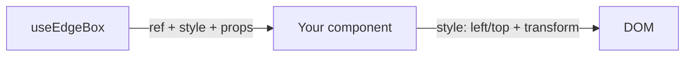

# EdgeBox Lite - `@edgebox-lite/react`

EdgeBox is a lightweight hook system for building **floating UI** in React (draggable menus, resizable panels, chat windows, tool palettes) using an **edges-first** coordinate model.

It’s designed for smooth interactions and low overhead:

- Uses `transform: translate3d(...)` for motion (good GPU-friendly rendering, avoids layout thrash)
- Keeps the runtime dependency-free and the math simple (good for low CPU usage during pointer move)
- Supports “commit” mode so frequent pointer updates don’t permanently rewrite your committed position

This repo contains the `@edgebox-lite/react` package.

## Features (at a glance)

- **Anchored positioning**: start at `top-left`, `bottom-right`, `top-center`, etc.
- **Edges-first model**: position is stored as `left/right/top/bottom` viewport coordinates.
- **Drag**: pointer drag with safe-zone clamping (keeps the element on-screen).
- **Resize**: 8-direction resize with min/max constraints and safe-zone clamping.
- **Multitouch-safe gestures**: drag and resize track the initiating mouse/touch `eventId`, so extra touches do not steal the active gesture.
- **Commit or not**: you can keep temporary offsets in state, or “commit” the final result back into `edges`.
- **Auto focus snapping** (optional): snap to edges / center / corners when a gesture ends.
- **Viewport clamp for auto-sized elements**: measure DOM size changes (via `ResizeObserver`) and clamp into the viewport.
- **Geometry helpers**: convert between rects and edges, align boxes, and clamp layout rects to the viewport.
- **Measurement helpers**: read DOM size or viewport size with small SSR-aware hooks.
- **Linked box helpers**: compute follower/overlay placement relative to another EdgeBox rectangle.
- **SSR-aware**: hooks guard access to `window`.

## Compatibility

**Languages**

- JavaScript (ESM + CJS builds)
- TypeScript (types included)

**React**

- React `>=18` (hooks)

**Frameworks / bundlers**

- Vite
- Next.js (client components; SSR-safe guards included)
- Remix
- CRA / custom Webpack

In general, it works in any React app that can run hooks in the browser.

## Install

Published package:

```bash
npm install @edgebox-lite/react
```

Local development (this repo):

```bash
npm install
npm run build
```

Try the runnable examples:

```bash
cd examples/playground
npm install
npm run dev
```

## Documentation

- Advanced usage → `docs/advanced.md`
- API reference → `docs/api.md`

## Exports

```ts
import {
  useEdgeBox,
  useEdgeBoxMeasuredSize,
  useEdgeBoxViewportSize,
  useEdgeBoxLinkedBoxes,
  resolveEdgeBoxPaddingValues,
  rectToEdges,
  edgesToRect,
  alignRect,
  clampRectToViewport,
} from "@edgebox-lite/react";
```

For the full exported hook list and hook-by-hook options/returns, see `docs/api.md`.

## Additional low-level helpers

Beyond `useEdgeBox()`, the package also exports smaller building blocks for advanced layout work:

- `useEdgeBoxMeasuredSize(ref)` – observe DOM size with `ResizeObserver`
- `useEdgeBoxViewportSize(options)` – track viewport width/height and inner size after padding
- `useEdgeBoxLinkedBoxes(options)` – compute follower/overlay rectangles from a source box
- `resolveEdgeBoxPaddingValues(padding)` – pure padding resolver without React state
- `rectToEdges`, `edgesToRect`, `edgesToOffsetRect` – convert between layout models
- `alignRect`, `clampRectToViewport` – position and clamp layout rects

See `docs/api.md` for signatures and `docs/advanced.md` for advanced usage patterns.

## Simple: `useEdgeBox()` general example

`useEdgeBox` is the simpler primary API. It composes:

1) committed position
2) drag state
3) resize state
4) final `transform`
5) ready-to-use drag / resize handle props

```tsx
import { useEdgeBox } from "@edgebox-lite/react";

export function FloatingWindow() {
  const {
    ref,
    style,
    isDragging,
    isPendingDrag,
    isResizing,
    getDragProps,
    getResizeHandleProps,
  } = useEdgeBox({
    position: "bottom-right",
    width: 420,
    height: 260,
    padding: 24,
    safeZone: 16,
    commitToEdges: true,
    minWidth: 300,
    minHeight: 200,
    autoFocus: "corners",
  });

  return (
    <div ref={ref} style={style}>
      <div {...getDragProps()}>
        Drag me
      </div>
      <div>{isDragging ? "Dragging" : isPendingDrag ? "Hold…" : isResizing ? "Resizing" : "Idle"}</div>
      <button {...getResizeHandleProps("se")}>
        Resize (bottom-right)
      </button>
    </div>
  );
}
```

If you want lower-level control, the individual hooks are still available and documented below.

- Advanced usage → `docs/advanced.md`
- Full API reference → `docs/api.md`

## Quick start (`useEdgeBox`)

Recommended default flow:

1) call `useEdgeBox(...)`
2) apply the returned `style` to the floating element
3) spread `getDragProps()` onto a drag handle or container
4) spread `getResizeHandleProps(direction)` onto resize handles

Minimal example shape:

```tsx
const {
  ref,
  style,
  getDragProps,
  getResizeHandleProps,
} = useEdgeBox({
  position: "bottom-right",
  width: 420,
  height: 260,
  padding: 24,
  safeZone: 16,
  commitToEdges: true,
});
```

### Simple draggable + resizable panel with `useEdgeBox()`

This is the same practical use case covered in `docs/advanced.md`, but using the higher-level API.

```tsx
import { useEdgeBox } from "@edgebox-lite/react";

export function FloatingPanel() {
  const {
    ref,
    style,
    isDragging,
    isPendingDrag,
    isResizing,
    getDragProps,
    getResizeHandleProps,
    resetPosition,
    resetSize,
  } = useEdgeBox({
    position: "bottom-right",
    width: 420,
    height: 260,
    padding: 24,
    safeZone: 16,
    commitToEdges: true,
    minWidth: 300,
    minHeight: 200,
    autoFocus: "corners",
  });

  return (
    <div ref={ref} style={style}>
      <div {...getDragProps()}>
        {isDragging ? "Dragging" : isPendingDrag ? "Hold…" : isResizing ? "Resizing" : "Idle"}
      </div>

      <button {...getResizeHandleProps("se")}>Resize</button>
      <button onClick={resetPosition}>Reset position</button>
      <button onClick={() => resetSize({ commit: true })}>Reset size</button>
    </div>
  );
}
```

### Simple drag-only example with `useEdgeBox()`

```tsx
import { useEdgeBox } from "@edgebox-lite/react";

export function DragOnlyBox() {
  const { ref, style, isDragging, getDragProps } = useEdgeBox({
    position: "bottom-left",
    width: 240,
    height: 140,
    padding: 24,
    safeZone: 16,
    draggable: true,
    resizable: false,
    commitToEdges: true,
  });

  return (
    <div ref={ref} style={style} {...getDragProps()}>
      {isDragging ? "Dragging" : "Drag me"}
    </div>
  );
}
```

### Simple resize-only example with `useEdgeBox()`

```tsx
import { useEdgeBox } from "@edgebox-lite/react";

export function ResizeOnlyBox() {
  const { ref, style, dimensions, getResizeHandleProps } = useEdgeBox({
    position: "top-right",
    initialWidth: 280,
    initialHeight: 180,
    padding: 24,
    safeZone: 16,
    draggable: false,
    resizable: true,
    minWidth: 200,
    minHeight: 120,
    commitToEdges: true,
  });

  return (
    <div ref={ref} style={style}>
      <div>{dimensions.width} × {dimensions.height}</div>
      <button {...getResizeHandleProps("se")}>Resize</button>
    </div>
  );
}
```

Touch note:

- `useEdgeBox().getDragProps()` wires both mouse and touch drag start handlers.
- `useEdgeBox().getResizeHandleProps(direction)` wires both mouse and touch resize start handlers.
- During an active drag/resize, additional touches are ignored until the active gesture ends.

Types:

- `Position`, `Dimensions`, `ResizeDirection`
- `EdgeBoxEdges`
- `EdgeBoxAutoFocus`
- `PaddingValue`, `PaddingValues`
- `CssEdgePosition`, `EdgePosition`, `UseEdgeBoxCssPositionResult`
- `EdgeBoxLayoutRect`

## API cheat sheet (what each hook does)



For lower-level manual composition, see `docs/advanced.md`.

For the full hook-by-hook reference, see `docs/api.md`.

The playground also includes advanced demos for:

- layout + rect helpers
- linked boxes + measurement helpers

## Package structure (this repo)

Package layout:

- `src/` – source (hooks + helpers)
- `dist/` – build output (`tsup`, ESM + CJS + types)
- `package.json` – package metadata (`exports`, `peerDependencies`, published `files`)

## Dependencies

From `package.json`:

- `peerDependencies`
  - `react: >=18`
- `devDependencies` (build-time only)
  - `tsup` (bundling)
  - `typescript` (type-checking + `.d.ts` emit)

EdgeBox itself is designed to be dependency-light and is intended to work with any React app that can run hooks.

## Core concepts

### Visual model (edges + offsets)

Think of EdgeBox in two layers:

- **Committed position**: `edges` (viewport coordinates)
- **Temporary motion**: offsets (`dragOffset`, `resizeOffset`) applied via CSS `transform`

```
viewport
┌──────────────────────────────────────────────┐
│ safeZone inset                               │
│   ┌──────────────────────────────────────┐   │
│   │                                      │   │
│   │   left/top/right/bottom = edges      │   │
│   │   + translate3d(x,y,0) = offsets     │   │
│   │                                      │   │
│   └──────────────────────────────────────┘   │
└──────────────────────────────────────────────┘
```

### 1) Edges are viewport coordinates

EdgeBox stores a rectangle as:

```ts
type EdgeBoxEdges = {
  left: number;
  right: number;
  top: number;
  bottom: number;
  center: { x: number; y: number };
};
```

All values are **pixel coordinates in the viewport** (i.e. `left=0` means flush to the left edge of the viewport).

### 2) `padding` vs `safeZone`

- `padding`: initial distance from the viewport edges for anchored placements (`bottom-right`, etc.).
- `safeZone`: the minimum inset from the viewport edges enforced during:
  - drag clamping
  - resize clamping
  - viewport resize (when `useEdgeBoxPosition` is in “manual” mode)
  - viewport clamp (`useEdgeBoxViewportClamp`)

In other words: **`padding` sets the start**, **`safeZone` is the boundary**.

### 3) Offsets are applied via `transform`

Drag/resize interactions typically produce *temporary* offsets (`dragOffset`, `resizeOffset`) that you apply with `translate3d(...)`.

### 4) “Commit” vs “non-commit” positioning

`useEdgeBox()` forwards `commitToEdges` into the lower-level drag and resize helpers:

- `commitToEdges: true` (common for app UIs)
  - while dragging/resizing you apply offsets via `transform`
  - on gesture end, the hook updates `edges` via `updateEdges(...)`
  - offsets are reset to `{ x: 0, y: 0 }`

- `commitToEdges: false` (lower-level usage)
  - the hook keeps offsets in state and does not mutate `edges`
  - you can treat the offsets as the “source of truth” and persist them externally

## Hook reference

### `useEdgeBox(options)`

High-level composite hook for the common EdgeBox pattern.

Use this when you want the simplest API for a draggable and/or resizable floating element without manually composing `useEdgeBoxPosition`, `useEdgeBoxDrag`, `useEdgeBoxResize`, and `useEdgeBoxTransform` yourself.

Options:

- `position?: EdgePosition` – anchored start position (default: `bottom-right`)
- `width?: number`, `height?: number` – initial box size
- `initialWidth?: number`, `initialHeight?: number` – aliases for initial size when you prefer resize-style naming
- `padding?: PaddingValue` – anchored inset (default: `24`)
- `safeZone?: number` – boundary inset (default: `0`)
- `disableAutoRecalc?: boolean` – disable automatic viewport resize recalculation
- `draggable?: boolean` (default: `true`)
- `resizable?: boolean` (default: `true`)
- `commitToEdges?: boolean` (default: `false`)
- `minWidth?`, `minHeight?`, `maxWidth?`, `maxHeight?` – resize constraints
- `autoFocus?: EdgeBoxAutoFocus`
- `autoFocusSensitivity?: number`
- `dragStartDistance?`, `dragStartDelay?`, `dragEndEventDelay?`
- `baseTransform?: string` – prepend a transform before the EdgeBox `translate3d(...)`
- `onCommitSize?`, `onDragEnd?`, `onResizeEnd?`

Returns:

- `ref`
- `style`
- `edges`, `dimensions`
- `dragOffset`, `resizeOffset`, `offset`, `transform`
- `isDragging`, `isPendingDrag`, `isResizing`, `resizeDirection`
- `updateEdges(...)`, `recalculate()`, `resetPosition()`
- `resetDragOffset()`, `cancelDrag()`, `resetSize(options?)`
- `handleMouseDown(e)`, `handleTouchStart(e)`, `handleResizeStart(direction, e)`
- `getDragProps()` – returns drag bindings for a drag handle or container
- `getResizeHandleProps(direction)` – returns bindings for a resize handle

Example:

```tsx
const {
  ref,
  style,
  getDragProps,
  getResizeHandleProps,
  resetPosition,
  resetSize,
} = useEdgeBox({
  position: "bottom-right",
  width: 420,
  height: 260,
  padding: 24,
  safeZone: 16,
  commitToEdges: true,
  autoFocus: "corners",
});
```

For the rest of the hook-by-hook reference, advanced low-level hooks, and full options/returns, see `docs/api.md`.

## Recipe: draggable + resizable floating panel

For most applications, this is now the recommended composition pattern:

1) `useEdgeBox()` holds the committed geometry and temporary interaction state.
2) `getDragProps()` is attached to the drag handle or container.
3) `getResizeHandleProps(direction)` is attached to resize handles.
4) Apply the returned `style` object directly to your floating element.

```tsx
const {
  ref,
  style,
  getDragProps,
  getResizeHandleProps,
} = useEdgeBox({
  position: "bottom-right",
  width: 420,
  height: 260,
  padding: 24,
  safeZone: 16,
  commitToEdges: true,
  minWidth: 300,
  minHeight: 200,
});
```

If you need custom low-level composition, use `docs/advanced.md`.

## Advanced recipe: primitive hook composition

See `docs/advanced.md` for the full low-level primitive composition tutorial, viewport clamp details, CSS-position details, and advanced recipes.

## Examples

This repository contains the hooks and helpers only; example app/components are not included.

## Logic flow (`useEdgeBox`)

Typical render/update loop for a floating element:

1) `useEdgeBox()` creates the committed position, interaction state, and render `style`.
2) Your component spreads `getDragProps()` onto a drag handle or container.
3) Your component spreads `getResizeHandleProps(direction)` onto resize handles.
4) The returned `style` applies fixed positioning, size, touch behavior, and the combined `transform`.
5) On gesture end:
   - if `commitToEdges: true`, `useEdgeBox()` commits the final geometry internally through `updateEdges(...)`
   - if `commitToEdges: false`, offsets remain the source of truth in local state
6) On viewport resize:
   - `useEdgeBox()` delegates to `useEdgeBoxPosition` for recalculation/clamping
   - drag/resize helpers keep interaction math aligned with the current viewport and safe zone

If you need to understand or override the lower-level pieces, see `docs/advanced.md` and `docs/api.md`.

## Deploy (npm)

1) Build the package:

```bash
npm run build
```

## Important warnings (CSS + transforms)

### Avoid transitions/animations on the *positioned container*

EdgeBox updates `left`/`top` (and applies `transform`) frequently during pointer interactions.

Do **not** apply `transition` / `animation` to these properties on the draggable/resizable container:

- `transform`
- `left`, `top`, `right`, `bottom`
- `width`, `height`

Why: any delay/easing on those properties will cause the DOM to “lag behind” pointer movement. This can create visible **jitter**, overshoot, and incorrect boundary/clamp behavior.

Recommended pattern:

- keep the outer EdgeBox-controlled element “instant” (no transitions)
- apply transitions to inner content elements instead (opacity, background, shadows, etc.)

## Common pitfalls (practical)

### Use viewport-relative positioning

EdgeBox `edges` are viewport coordinates, so the positioned element is typically `position: fixed`.

If you place the element inside a transformed/zoomed parent, or inside a scroll container, viewport math and DOM rects (`getBoundingClientRect`) may no longer match your intended coordinate space.

### Compose transforms (don’t overwrite them)

EdgeBox expects to control `transform` for movement.

If you also need a base transform (e.g. `translateX(-50%)` for centered anchors, scaling, rotation), **compose it into one `transform` string** rather than setting `transform` in two places.

Example (good):

```ts
const transform = `${baseTransform} translate3d(${offset.x}px, ${offset.y}px, 0)`;
```

### Prefer `elementRef` for accurate sizing

If possible, pass an `elementRef` into drag/viewport clamp so EdgeBox can measure the real DOM rect (including changes due to fonts, content, responsive layout, etc.).

### CSS example: what *not* to do

Bad (causes jitter/lag):

```css
.floating {
  transition: all 300ms ease;
  transition-delay: 100ms;
}
```

Good:

```css
.floating {
  /* no transitions on the EdgeBox-controlled container */
}

.floatingContent {
  transition: opacity 300ms ease;
}
```
