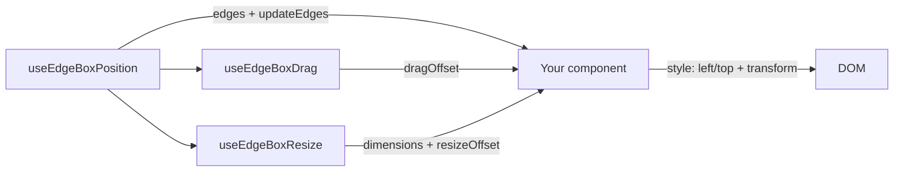

# `@edgebox/react`

EdgeBox is a small hook system for building **floating UI** in React (draggable menus, resizable panels, chat windows, tool palettes) using an **edges-first** coordinate model.

This repo contains the `@edgebox/react` package.

## Features (at a glance)

- **Anchored positioning**: start at `top-left`, `bottom-right`, `top-center`, etc.
- **Edges-first model**: position is stored as `left/right/top/bottom` viewport coordinates.
- **Drag**: pointer drag with safe-zone clamping (keeps the element on-screen).
- **Resize**: 8-direction resize with min/max constraints and safe-zone clamping.
- **Commit or not**: you can keep temporary offsets in state, or “commit” the final result back into `edges`.
- **Auto focus snapping** (optional): snap to edges / center / corners when a gesture ends.
- **Viewport clamp for auto-sized elements**: measure DOM size changes (via `ResizeObserver`) and clamp into the viewport.
- **SSR-aware**: hooks guard access to `window`.

## Install

Published package:

```bash
npm install @edgebox/react
```

Local development (this repo):

```bash
npm install
npm run build
```

Try the runnable examples:

```bash
cd examples/playground
npm install
npm run dev
```

## Exports

```ts
import {
  usePaddingValues,
  useCssEdgePosition,
  useEdgeBoxPosition,
  useEdgeBoxDrag,
  useEdgeBoxResize,
  useEdgeBoxViewportClamp,
} from "@edgebox/react";
```

## Quick start (drag + resize)

Minimal pattern:

1) `useEdgeBoxPosition` gives you committed `edges`.
2) `useEdgeBoxDrag` / `useEdgeBoxResize` give you temporary offsets.
3) You render `position: fixed` with `left/top` from `edges`, and apply a `transform` using offsets.

```tsx
import { useMemo, useRef, useState } from "react";
import { useEdgeBoxPosition, useEdgeBoxDrag, useEdgeBoxResize, usePaddingValues } from "@edgebox/react";

export function FloatingWindow() {
  const ref = useRef<HTMLDivElement>(null);
  const paddingValues = usePaddingValues(24);
  const safeZone = 16;

  const [committedSize, setCommittedSize] = useState({ width: 420, height: 260 });

  const { edges, updateEdges } = useEdgeBoxPosition({
    position: "bottom-right",
    width: committedSize.width,
    height: committedSize.height,
    padding: paddingValues,
    safeZone,
  });

  const { dragOffset, handleMouseDown, handleTouchStart, isDragging, isPendingDrag } = useEdgeBoxDrag({
    edges,
    updateEdges,
    commitToEdges: true,
    elementRef: ref,
    safeZone,
  });

  const { dimensions, resizeOffset, isResizing, handleResizeStart } = useEdgeBoxResize({
    edges,
    updateEdges,
    commitToEdges: true,
    onCommitSize: setCommittedSize,
    baseOffset: dragOffset,
    initialWidth: committedSize.width,
    initialHeight: committedSize.height,
    minWidth: 300,
    minHeight: 200,
    safeZone,
  });

  const currentOffset = useMemo(
    () => ({
      x: dragOffset.x + (isResizing ? resizeOffset.x : 0),
      y: dragOffset.y + (isResizing ? resizeOffset.y : 0),
    }),
    [dragOffset, isResizing, resizeOffset]
  );

  const style = useMemo((): React.CSSProperties => ({
    position: "fixed",
    left: edges.left,
    top: edges.top,
    width: dimensions.width,
    height: dimensions.height,
    transform: `translate3d(${currentOffset.x}px, ${currentOffset.y}px, 0)`,
    touchAction: "none",
  }), [edges, dimensions, currentOffset]);

  return (
    <div ref={ref} style={style} onMouseDown={handleMouseDown} onTouchStart={handleTouchStart}>
      <div>{isDragging ? "Dragging" : isPendingDrag ? "Hold…" : isResizing ? "Resizing" : "Idle"}</div>
      <button onMouseDown={(e) => handleResizeStart("se", e)}>Resize (bottom-right)</button>
    </div>
  );
}
```

Types:

- `Position`, `Dimensions`, `ResizeDirection`
- `EdgeBoxEdges`
- `EdgeBoxAutoFocus`
- `PaddingValue`, `PaddingValues`
- `CssEdgePosition`, `EdgePosition`

## Beginner tutorial (copy/paste)

### Requirements

- React 18+
- Your floating element should usually be `position: fixed` (because EdgeBox uses viewport coordinates)
- Add `touchAction: "none"` to the draggable/resizable element (prevents the browser from treating touch as scroll/zoom)

### Step 1: Create a `ref`

EdgeBox can measure the element for better boundary clamping.

```tsx
const panelRef = useRef<HTMLDivElement>(null);
```

### Step 2: Pick `padding` and `safeZone`

- `padding` = where the element starts (anchored inset)
- `safeZone` = where the element is allowed to be (clamp boundary)

```tsx
const paddingValues = usePaddingValues(24);
const safeZone = 16;
```

### Step 3: Position (committed `edges`)

```tsx
const { edges, updateEdges } = useEdgeBoxPosition({
  position: "bottom-right",
  width: 420,
  height: 260,
  padding: paddingValues,
  safeZone,
});
```

### Step 4: Drag (temporary `dragOffset`)

```tsx
const { dragOffset, handleMouseDown, handleTouchStart } = useEdgeBoxDrag({
  edges,
  updateEdges,
  commitToEdges: true,
  elementRef: panelRef,
  safeZone,
});
```

### Step 5: Resize (temporary `resizeOffset` + `dimensions`)

Most UIs also keep a committed size, so the next render starts from the last size.

```tsx
const [committedSize, setCommittedSize] = useState({ width: 420, height: 260 });

const { dimensions, resizeOffset, handleResizeStart, isResizing } = useEdgeBoxResize({
  edges,
  updateEdges,
  commitToEdges: true,
  onCommitSize: setCommittedSize,
  baseOffset: dragOffset,
  initialWidth: committedSize.width,
  initialHeight: committedSize.height,
  minWidth: 300,
  minHeight: 200,
  safeZone,
});
```

### Step 6: Render (`edges` + offsets)

```tsx
const offset = {
  x: dragOffset.x + (isResizing ? resizeOffset.x : 0),
  y: dragOffset.y + (isResizing ? resizeOffset.y : 0),
};

return (
  <div
    ref={panelRef}
    style={{
      position: "fixed",
      left: edges.left,
      top: edges.top,
      width: dimensions.width,
      height: dimensions.height,
      transform: `translate3d(${offset.x}px, ${offset.y}px, 0)`,
      touchAction: "none",
    }}
    onMouseDown={handleMouseDown}
    onTouchStart={handleTouchStart}
  />
);
```

## API cheat sheet (what each hook does)



| Hook | What it solves | You give it | You get back |
|---|---|---|---|
| `usePaddingValues` | Turn shorthand padding into `{top,right,bottom,left}` | `number` or object | `PaddingValues` |
| `useEdgeBoxPosition` | Initial anchored placement + viewport-resize recalc | `position`, `width/height`, `padding`, `safeZone` | `edges`, `updateEdges`, `recalculate` |
| `useEdgeBoxDrag` | Dragging + boundary clamping | `edges`, `updateEdges`, `elementRef`, `safeZone` | `dragOffset`, `handleMouseDown`, `handleTouchStart`, flags |
| `useEdgeBoxResize` | Resizing + constraints + safe-zone clamping | `edges`, `updateEdges`, `baseOffset`, constraints | `dimensions`, `resizeOffset`, `handleResizeStart`, flags |
| `useEdgeBoxViewportClamp` | Keep auto-sized DOM inside viewport | `elementRef`, `updateEdges`, `deps` | (no return; commits corrected `edges`) |

## Package structure (this repo)

Package layout:

- `src/` – source (hooks + helpers)
- `dist/` – build output (`tsup`, ESM + CJS + types)
- `package.json` – package metadata (`exports`, `peerDependencies`, published `files`)

## Dependencies

From `package.json`:

- `peerDependencies`
  - `react: >=18`
- `devDependencies` (build-time only)
  - `tsup` (bundling)
  - `typescript` (type-checking + `.d.ts` emit)

EdgeBox itself is designed to be dependency-light and is intended to work with any React app that can run hooks.

## Core concepts

### Visual model (edges + offsets)

Think of EdgeBox in two layers:

- **Committed position**: `edges` (viewport coordinates)
- **Temporary motion**: offsets (`dragOffset`, `resizeOffset`) applied via CSS `transform`

```
viewport
┌──────────────────────────────────────────────┐
│ safeZone inset                               │
│   ┌──────────────────────────────────────┐   │
│   │                                      │   │
│   │   left/top/right/bottom = edges      │   │
│   │   + translate3d(x,y,0) = offsets     │   │
│   │                                      │   │
│   └──────────────────────────────────────┘   │
└──────────────────────────────────────────────┘
```

### 1) Edges are viewport coordinates

EdgeBox stores a rectangle as:

```ts
type EdgeBoxEdges = {
  left: number;
  right: number;
  top: number;
  bottom: number;
  center: { x: number; y: number };
};
```

All values are **pixel coordinates in the viewport** (i.e. `left=0` means flush to the left edge of the viewport).

### 2) `padding` vs `safeZone`

- `padding`: initial distance from the viewport edges for anchored placements (`bottom-right`, etc.).
- `safeZone`: the minimum inset from the viewport edges enforced during:
  - drag clamping
  - resize clamping
  - viewport resize (when `useEdgeBoxPosition` is in “manual” mode)
  - viewport clamp (`useEdgeBoxViewportClamp`)

In other words: **`padding` sets the start**, **`safeZone` is the boundary**.

### 3) Offsets are applied via `transform`

Drag/resize interactions typically produce *temporary* offsets (`dragOffset`, `resizeOffset`) that you apply with `translate3d(...)`.

### 4) “Commit” vs “non-commit” positioning

Both `useEdgeBoxDrag` and `useEdgeBoxResize` support `commitToEdges`:

- `commitToEdges: true` (common for app UIs)
  - while dragging/resizing you apply offsets via `transform`
  - on gesture end, the hook updates `edges` via `updateEdges(...)`
  - offsets are reset to `{ x: 0, y: 0 }`

- `commitToEdges: false` (lower-level usage)
  - the hook keeps offsets in state and does not mutate `edges`
  - you can treat the offsets as the “source of truth” and persist them externally

## Hook reference

### `usePaddingValues(padding)`

Normalizes a `number` or shorthand object into `PaddingValues`.

```ts
const paddingValues = usePaddingValues({ all: 24, horizontal: 32 });
// => { top: 24, right: 32, bottom: 24, left: 32 }
```

### `useEdgeBoxPosition(options)`

Tracks the committed box position (`edges`) and recalculates/clamps it on viewport resize.

Options:

- `position?: EdgePosition` – anchored start position (default: `bottom-right`)
- `width?: number`, `height?: number` – known box dimensions (recommended)
- `padding?: PaddingValues | number` – anchored inset (default: `24`)
- `safeZone?: number` – boundary inset (default: `0`)
- `disableAutoRecalc?: boolean` – disables automatic recalculation on `window.resize` (default: `false`)

Returns:

- `edges`
- `recalculate()`
- `updateEdges(partialEdges)` – switches EdgeBox into “manual mode” (future recalcs clamp the manual position instead of re-anchoring)

### `useEdgeBoxDrag(options)`

Adds draggable behavior and boundary clamping.

Options (all):

- `edges: EdgeBoxEdges`
- `updateEdges?: (partial: Partial<EdgeBoxEdges>) => void`
- `commitToEdges?: boolean` (default: `false`)
- `safeZone?: number` (default: `0`)
- `dragStartDistance?: number` (default: `6`)
- `dragStartDelay?: number` (default: `150`)
- `dragEndEventDelay?: number` (default: `150`)
- `autoFocus?: EdgeBoxAutoFocus` (default: `unset`)
- `autoFocusSensitivity?: number` (default: `5`)
- `elementWidth?: number`, `elementHeight?: number` – optional sizing hints if you can’t provide an `elementRef`
- `elementRef?: React.RefObject<HTMLElement>` – preferred for accurate sizing
- `onDragEnd?: (finalOffset: Position) => void`

Returns:

- `dragOffset: { x, y }`
- `isDragging`, `isPendingDrag`
- `handleMouseDown(e)`, `handleTouchStart(e)`
- `resetDragOffset()`

Viewport resize note:

- If `commitToEdges` is `true` and offsets are already committed (offset is `0,0`), the drag hook will not apply additional viewport-resize clamping. This avoids “double correction” when `useEdgeBoxPosition` also clamps `edges`.

### Auto focus (optional snapping)

Both `useEdgeBoxDrag` and `useEdgeBoxResize` can apply **auto focus** on gesture end.

Auto focus means: if the box is already inside the `safeZone` and ends up *near* a “snap target” (edge/center/corner) it can be adjusted to align exactly.

- `autoFocus?: EdgeBoxAutoFocus` (default: `unset`)
- `autoFocusSensitivity?: number` (default: `5`) – interpreted as a **percentage of the viewport** (higher = easier snapping)

Supported presets (see `src/autoFocus.ts` for the authoritative list):

- `unset`
- `all`, `full`
- `horizontal`, `vertical`
- `top`, `bottom`, `left`, `right`
- `right-left`, `bottom-top`
- `full-horizontal-vertical`, `horizontal-vertical`
- `full-horizontal`, `full-vertical`
- `full-top`, `full-bottom`, `full-left`, `full-right`
- `corners`
- `right-bottom`, `right-top`, `left-bottom`, `left-top`

Advanced: you can also pass a comma-separated string of numeric “areas” (e.g. `"1,2,10"`) to control snapping more granularly.

### `useEdgeBoxResize(options)`

Adds 8-direction resize behavior with min/max constraints and safe-zone clamping.

Options (all):

- `edges: EdgeBoxEdges`
- `updateEdges?: (partial: Partial<EdgeBoxEdges>) => void`
- `commitToEdges?: boolean` (default: `false`)
- `onCommitSize?: (dimensions: Dimensions) => void` – persist final size externally
- `baseOffset?: Position` – use the current drag offset so resize math stays aligned (default: `{ x: 0, y: 0 }`)
- `initialWidth?: number` (default: `420`), `initialHeight?: number` (default: `550`)
- `minWidth?: number` (default: `300`), `minHeight?: number` (default: `400`)
- `maxWidth?: number` (default: `window.innerWidth` / fallback `1920`)
- `maxHeight?: number` (default: `window.innerHeight` / fallback `1080`)
- `safeZone?: number` (default: `0`)
- `autoFocus?: EdgeBoxAutoFocus` (default: `unset`)
- `autoFocusSensitivity?: number` (default: `5`)
- `onResizeEnd?: (finalDimensions: Dimensions, finalOffset: Position) => void`

Returns:

- `dimensions: { width, height }`
- `resizeOffset: { x, y }`
- `isResizing`, `resizeDirection`
- `handleResizeStart(direction, e)`
- `resetDimensions()`

### `useEdgeBoxViewportClamp(options)`

DOM-measure clamp for elements whose size changes *outside* drag/resize gestures (menus, popovers, dynamic content, responsive layout changes).

Options:

- `elementRef: React.RefObject<HTMLElement>`
- `updateEdges(partialEdges)`
- `safeZone?: number` (default: `0`)
- `disabled?: boolean` (default: `false`)
- `deps?: readonly unknown[]` (default: `[]`) – re-clamp after these dependencies change

### `useCssEdgePosition(options)`

Low-level helper that returns “CSS edge style” (`left`/`right`/`top`/`bottom`) for an anchored position. Most components in this repo use `useEdgeBoxPosition` directly instead.

Options:

- `position: EdgePosition`
- `paddingValues: PaddingValues`

## Recipe: draggable + resizable floating panel

This is the standard composition pattern:

1) `useEdgeBoxPosition` holds the committed `edges`.
2) `useEdgeBoxDrag` produces `dragOffset`.
3) `useEdgeBoxResize` produces `dimensions` and `resizeOffset`.
4) Apply `edges` via CSS `left/top` and apply combined offsets via `transform`.

If you use both drag and resize together, pass the current drag offset as `baseOffset` into resize so resize math matches the element’s transformed position.

## Examples

This repository contains the hooks and helpers only; example app/components are not included.

## Logic flow (how the hooks work together)

Typical render/update loop for a floating element:

1) `useEdgeBoxPosition` provides committed `edges`.
2) Drag/resize hooks produce temporary offsets (`dragOffset`, `resizeOffset`) and/or dimensions.
3) Your component renders with:
   - static positioning: `left: edges.left`, `top: edges.top` (or `right/bottom` for auto-size patterns)
   - dynamic movement: `transform: translate3d(offsetX, offsetY, 0)`
4) On gesture end:
   - if `commitToEdges: true`, the hook calls `updateEdges(...)` and resets offsets back to `0,0`
   - if `commitToEdges: false`, offsets remain as the source of truth
5) On viewport resize:
   - `useEdgeBoxPosition` recalculates/clamps anchored boxes
   - if the element is in “manual mode” (after `updateEdges`), it clamps the manual position into `safeZone`

## Deploy (npm)

1) Build the package:

```bash
npm run build
```

## Important warnings (CSS + transforms)

### Avoid transitions/animations on the *positioned container*

EdgeBox updates `left`/`top` (and applies `transform`) frequently during pointer interactions.

Do **not** apply `transition` / `animation` to these properties on the draggable/resizable container:

- `transform`
- `left`, `top`, `right`, `bottom`
- `width`, `height`

Why: any delay/easing on those properties will cause the DOM to “lag behind” pointer movement. This can create visible **jitter**, overshoot, and incorrect boundary/clamp behavior.

Recommended pattern:

- keep the outer EdgeBox-controlled element “instant” (no transitions)
- apply transitions to inner content elements instead (opacity, background, shadows, etc.)

## Common pitfalls (practical)

### Use viewport-relative positioning

EdgeBox `edges` are viewport coordinates, so the positioned element is typically `position: fixed`.

If you place the element inside a transformed/zoomed parent, or inside a scroll container, viewport math and DOM rects (`getBoundingClientRect`) may no longer match your intended coordinate space.

### Compose transforms (don’t overwrite them)

EdgeBox expects to control `transform` for movement.

If you also need a base transform (e.g. `translateX(-50%)` for centered anchors, scaling, rotation), **compose it into one `transform` string** rather than setting `transform` in two places.

Example (good):

```ts
const transform = `${baseTransform} translate3d(${offset.x}px, ${offset.y}px, 0)`;
```

### Prefer `elementRef` for accurate sizing

If possible, pass an `elementRef` into drag/viewport clamp so EdgeBox can measure the real DOM rect (including changes due to fonts, content, responsive layout, etc.).

### CSS example: what *not* to do

Bad (causes jitter/lag):

```css
.floating {
  transition: all 300ms ease;
  transition-delay: 100ms;
}
```

Good:

```css
.floating {
  /* no transitions on the EdgeBox-controlled container */
}

.floatingContent {
  transition: opacity 300ms ease;
}
```
